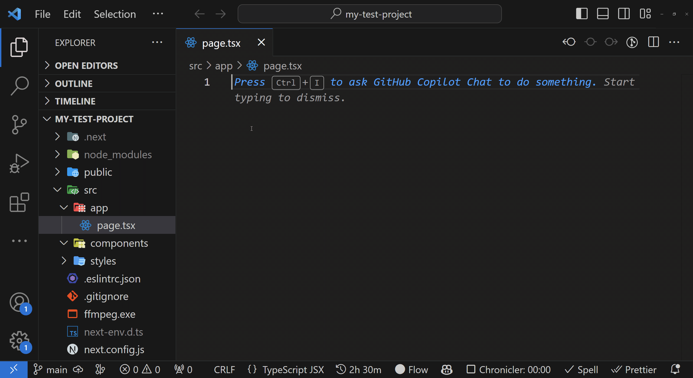

# 🧙‍♂️ NexTemplates for Next.js 13+

✨ Welcome to **NexTemplates**—your magical extension for VS Code that propels your Next.js 13+ development journey to the stratosphere. Say goodbye to monotonous boilerplate and hello to instant scaffolding!

## 🎩 Features: Where Magic Happens!

**NexTemplates** harnesses the arcane arts to transform simple prefixes into robust Next.js components. Just whisper the right incantation, and behold as your spell manifests!

| prefix  | summons                                |
| ------- | -------------------------------------- |
| `npc`   | Next page component                    |
| `npcp`  | Next Page component with props         |
| `ncc`   | Next Client component                  |
| `nccp`  | Next Client component with props       |
| `nsc`   | Next Server component                  |
| `nscp`  | Next Server component with props       |
| `nasc`  | Next Async server component            |
| `nascp` | Next Async server component with props |
| `nlc`   | Next layout component                  |
| `nmw`   | Next Middleware                        |
| `nsmd`  | Next Static metadata                   |
| `ngmd`  | Next Generated metadata                |
| `nec`   | Next error component                   |
| `ngec`  | Next global-error component            |
| `nnfc`  | Next not-found component               |

> 🌌 **Mystic Tip**: For a visual spectacle of these spells, let the GIF above guide you!

## 📜 Prerequisites

Before wielding this powerful extension, ensure you've mastered the scrolls of Next.js and React. If these aren't in your grimoire yet, best obtain them first.

## 🔮 Usage

1. **Installation**: Invoke the **NexTemplates** extension from the VS Code marketplace.
2. **Casting Spells**: In any `typescript` file, type your chosen prefix (like `npc` for a new page component). Hit `Tab`, and watch the magic unfold.
3. **Customization**: Each spell (snippet) contains placeholders (`$1`, `$2`, etc.) that guide your incantations. Navigate between them using the `Tab` key to customize the generated component.

## 📌 Enhancements

1. **GitHub Copilot Synergy**: Combine the might of **NexTemplates** with [GitHub Copilot](https://copilot.github.com/) to ascend to coding divinity. Let Copilot complete your spells and incantations, making the coding process truly ethereal.

2. **Optimal Setting**: To ensure your spells are woven seamlessly, consider setting `"editor.suggest.snippetsPreventQuickSuggestions": true` in your VS Code settings. This arcane tweak ensures that the auto-suggestions don't interfere with the magic of your snippets.

## 🎉 Concluding the Ritual

With **NexTemplates**, each line of code feels like a mystical chant, and redundant code becomes folklore. Embrace the enchantment and let your Next.js journey be filled with wonder.

May your code be forever enchanted! ✨
